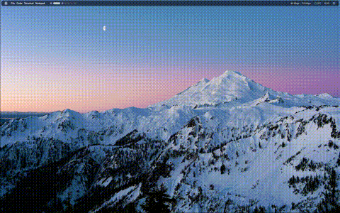

<div align="center">


#  **Cycling Wallpaper Program**


<br>

**Lumina** es una herramienta estética para Windows diseñada para elevar tu experiencia de escritorio. Combina un **difuminado adaptativo** inteligente con un **ciclado de fondos de pantalla** fluido, transformando tu entorno de trabajo en un espacio dinámico y visualmente agradable.

<br>

<a href="videos/showcase.mp4" target="_blank">
  
</a>

</div>

---

## Tabla de Contenidos

- [Instalación](#-instalación)
- [Uso](#-uso)
- [Roadmap](#-roadmap)
- [Contribución](#-contribución)
- [Licencia](#-licencia)

---

## Instalación

Sigue estos sencillos pasos para poner en marcha Lumina:

1.  **Clona o descarga** este repositorio en tu equipo.
    ```bash
    git clone https://github.com/meatbaalzzz/lumina.git
    ```
2.  **Prepara tus Wallpapers**:
    - Navega a la carpeta `wallpapers` dentro del directorio del proyecto.
    - Añade tus imágenes favoritas en formato `.png`.
    - Lumina las detectará automáticamente.
3.  **Inicia Lumina**:
    - Ejecuta el archivo `lumina.vbs`.
    - ¡Listo! Lumina comenzará a gestionar tu fondo de pantalla silenciosamente en segundo plano.

> **Nota:** Se recomienda crear un acceso directo del archivo `lumina.vbs` y pegarlo en la ruta de startup en Windows, 
```files
C:\Users\tu-usuario\AppData\Roaming\Microsoft\Windows\Start Menu\Programs\Startup
```
---

## Uso

Lumina funciona de manera autónoma. Una vez iniciado mediante `lumina.vbs`, el script:
- Escaneará la carpeta `wallpapers`.
- Ciclará entre las imágenes con transiciones suaves (fade).
- Aplicará los efectos configurados.

Para detener Lumina, puedes buscar el proceso de PowerShell en el Administrador de Tareas o reiniciar tu sesión (si no se ha configurado para inicio automático).

---

## Roadmap

El futuro de Lumina es brillante. Aquí hay algunas características planeadas:

- [ ] **Interfaz Gráfica (GUI)**: Panel de control para configurar tiempos y efectos sin editar código.
- [ ] **Soporte Multi-monitor**: Gestión independiente para cada pantalla.
- [ ] **Efectos Avanzados**: Nuevas transiciones y filtros de imagen.
- [ ] **Integración Cloud**: Descarga automática de wallpapers desde fuentes online.

---

## Contribución

¡Las contribuciones son bienvenidas! Si tienes ideas para mejorar Lumina, no dudes en hacer un fork y enviar un Pull Request.

1.  Haz un Fork del proyecto.
2.  Crea tu rama de características (`git checkout -b feature/AmazingFeature`).
3.  Commit a tus cambios (`git commit -m 'Add some AmazingFeature'`).
4.  Push a la rama (`git push origin feature/AmazingFeature`).
5.  Abre un Pull Request.

<a href="videos/workingexample.mp4" target="_blank">
  
</a>

---

## 📄 Licencia

Este proyecto está bajo la Licencia MIT. Consulta el archivo [LICENSE](LICENSE) para más detalles.


